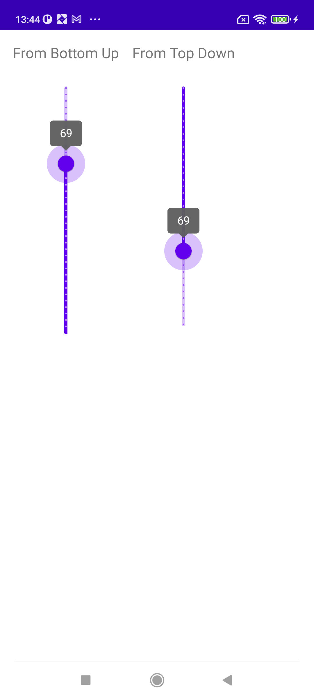
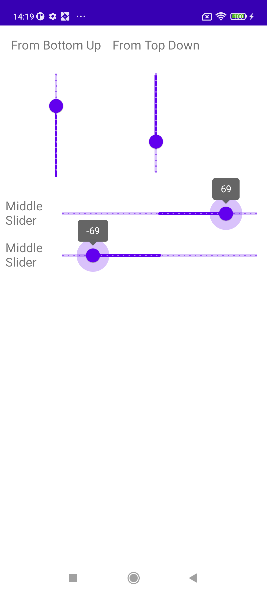

# Android-Horizontal-Slider
[](https://github.com/longdt57/Android-Material-Slider/releases)
These Sliders base on Material Library version 1.9.0

## ScreenShots
| Vertical Slider | Horizontal Middle Slider |
|-|-|
|  |  |

## Implementation

### build.gradle
```
repositories {
  maven { url "https://jitpack.io" }
}

```
### [module]/build.gradle

```

dependencies {
  implementation 'com.github.longdt57:Android-Material-Slider:{version}'
}
```

## Usage
### 1. VerticalSlider
```
<lee.module.slider.vertical.VerticalSlider
    android:id="@+id/slider"
    android:layout_width="wrap_content"
    android:layout_height="300dp"
    ...
    />
```
- Set maxHeight by: verticalSlider.maxHeight = 1000
- Set upSideDown: setUpsideDown(true)

### 2. MiddleSlider
```
<lee.module.slider.middle.MiddleSlider
    android:layout_width="match_parent"
    android:layout_height="wrap_content"
    android:value="0"
    android:valueFrom="-100"
    android:valueTo="100" />
```
- Set middle point: slider.valueActiveFixed = 0f
